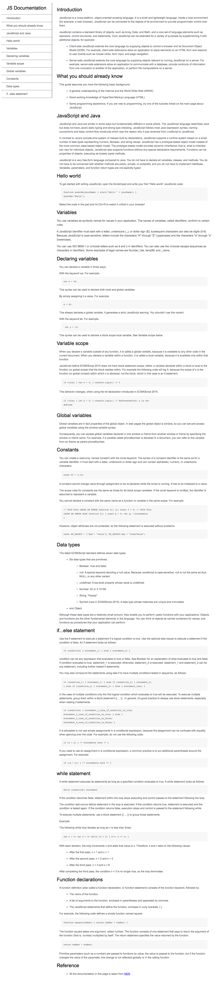

# Weekly Project - WEEK 01

Task guidelines for first weekly project.

**Dated: 27th April 2020**

**Submission Deadline: 3rd May 2020**

**Submission method**

All of you are well aware now of how to use github, create your account on github if you have not yet created. Then you will make a repository for your first project and submit the github link of that repository on the submission date. Your projects will only be accepted and assessed if you send the github link of the repository containing your project.  

## Objective
> To design a basic technical documentation page.

## Prerequisites 

### HTML 

- DOM Tree
- Semantic tags
- Presentational tags

### CSS

- Basic style properties
- Selectors
- Color convention
- Selectors
- CSS Positioning

You have studied the offline lessons given to you and have taken quizzes to self-assess yourself.

## Overview of the Task

The task is to design a simple documentation page according to the steps provided. You need to go through each step carefully and then design the website. Mockup of the website has been provided to you.

## Mockup Details

You have to design a website similar to the mockup provided. Scroll down the page to see the mockup image of the website.

## Instructions and steps to design the website

You are provided with the steps below, carefully observe each step and start building the documentation page.

##### Step #1: 
> There should be a *main* element with a corresponding id="main-doc", which contains the page’s main content (technical documentation).

##### Step #2:  
> Within the #main-doc element, there should be several *section* elements, each with a class of *main-section*. There should be a minimum of 5 sections.

##### Step #3:  
> The first element within each .main-section should be a *header element* which should have text that describes the topic of that section.

##### Step #4: 
> Each section element with the class of *main-section* should also have an *id* that corresponds with the text of each header contained within it. All spaces should be replaced with underscores (e.g. The section that contains the header "JavaScript and Java" should have a corresponding id="JavaScript_and_Java").

##### Step #5:  
> The .main-section elements should contain at least 10 p elements total (not each).

##### Step #6: 
> The *.main-section* elements should contain at least 5 code elements total (not each).

##### Step #7: 
> The *.main-section* elements should contain at least 5 li items total (not each).

##### Step #8: 
> There should be a nav element with a corresponding *id="navbar"*. 

##### Step #9: 
> The navbar element should contain one header element which contains text that describes the topic of the technical documentation.

##### Step #10: 
> Additionally, the navbar should contain a link element with a class of *nav-link*. There should be one for every element with the class *main-section*.

##### Step #11: 
> The header element in the navbar must come before any link (a) elements in the navbar.

##### Step #12: 
> Each element with the class of *nav-link* should contain text that corresponds to the header text within each section (e.g. if you have a “Hello world” section/header, your navbar should have an element which contains the text “Hello world”).

##### Step #13: 
> When you click on a navbar element, the page should navigate to the corresponding section of the main-doc element (e.g If you click on a nav-link element that contains the text “Hello world”, the page navigates to a section element that has that id and contains the corresponding header.

###### GOOD LUCK!

##### MOCKUP IMAGE ATTACHED BELOW

